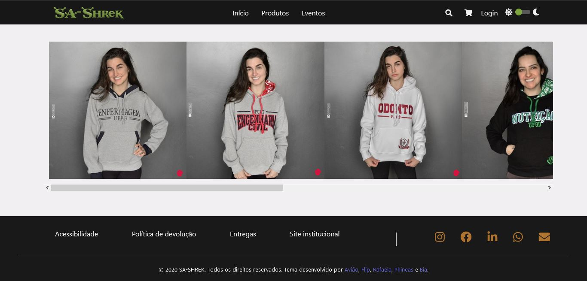

__Nome:                     | nºUSP:__  
_Beatriz Helena Dias Rocha   | 11300051_  
_Juliana Bernardes Freitas   | 11317928_  
_Lucas Henrique Sant'Anna    | 10748521_  
_Lucas Viana Vilela          | 10748409_  
_Rafaela Cristina Bull       | 11233651_  
__Grupo - 1__  
  
------------------------------------------  
  
# Relatório do Projeto: E-Commerce
## SCC219 - Introdução ao Desenvolvimento Web


### 1. Requerimentos

  
  A descrição do projeto em sua versão final requeria para a presente etapa já algumas funcionalidades. Porém como o e-commerce aqui implementado é voltado para servir a uma entidade universitária para suas eventuais vendas de artigos e eventos, algumas particularidades foram adicionadas aos requerimentos iniciais. E resumo os requerimentos são estes:  
  - Dois tipos de usuários:  
    - Cliente - Esse tipo de conta conseguem escolher os produtos que deseja comprar e percorrer todo o processo para realizar o pedido. 
    
    - Administrador - Uma conta de administrador consegue adicionar novos administradores e gerencia-los, assim como pode fazer o mesmo para contas cliente. Também gerencia o estoque dos itens e o fluxo de pedidos. 
    
    
 - Como a SA-SHREK vende produtos então seguimos os requerimentos correspondetes a tal. Isto é, o cliente pode escolher entre produtos e eventos. Selecionando, quando habilitado, as especificação do item (tamanho, quantidade e modelagem) e adicionando-o ao carrinho de compras. Passando por todo o processo até concluir a compra e escolhendo no caminho outras especifiações do pedido, como por exemplo a forma de pagamento. Nas especificações fornecidas cosntava o cartão de crédito como uma forma de pagamento, utilizamos na implementação apenas transferências por essa ser a opção mais dentro do contexto onde a loja está inserida, mas para a versão final planeja-se incluir a opção sugerida para fins de demonstração. Foi incluido ainda nesse projeto a funcionalidade de cupons de desconto.  
 
 - Clientes, Administradores e os Itens da Loja guardam diversos registros que os classificam, idetificam e carregam com sigo propriedades para serem usadas dentro a implementação. Esses registros estão abaixo:   
   - __Registros dos Clientes:__ name, type (que nesse caso será 'client'), e-mail, password, birthday, cpf, phoneNumber;  
   
   - __Registros dos Administradores:__ name, type (admin), e-mail, password, birthday, cpf, phoneNumber;  
   
   - __Registros de Itens:__ Devemos aqui fazer uma pequena distição entre os dois tipos de itens vendidos na loja. Podemos perceber muitors registros semelhantes, mas entre o tipo Produtos e Eventos há particularidades que melhor representam aquilo que será vendido. Muitas vezes alguns desses registros não são utilizados, deixam seu valor em _null_.  
       
       _Produtos:_ name, type(os produtos são do tipo 'PR'), id, visibility, category, description, templates, sizes, colors, price(full, sale), img, sizeTable (uma imagem que contêm todos os tamanhos do produto), stock(quantidade em estoque).  
       
       _Eventos:_  name, type('EV'), id, visibility, description, templates, sizes, colors, info(location, date, time, link), price(full, sale), stock.  
   
 - O gerenciamento dos Produtos, e até mesmo de usuários, é realizado pelos administradores. Esses usuários especiais administram a loja pela __Página do Administrador__ onde conseguem ter o controle de todos os produtos que são vendidos na loja, podendo editar suas propriedades (Nome, Imagens, texto da Imagem, Preço, Preço com desconto, Tipo, Categoria, Descrição e Quantidade) e opção de escolha (Modelagem, Tamanho e Cor). Conseguem ver os pedidos realizados e seus status, assim como produtos cadastrados no site, mas que não estão visíveis aos clietes. Outra aba desta página é a Novo Pedido, onde há a opção de cadastras novos produtos especificando as propriedades já citadas. A ultima aba contém todos os usuários cadastrados, por ela se administra tanto cliente quanto administradores dependendo da hierarquia. 
 
   
 
 
 
 - Foram implementados ao projeto funcionalidades e ferramentas para prover cada um dos itens a seguir:  
   - __Acessibilidade:__   
   Além de resursos de acessibilidade padrão, como texto alternativo para imagens, foram implementados recursos de menor presença nos projetos web. O primeiro é a mudança de cores das páginas para torna-las acessiveis para daltônicos. Tal recurso pode ser visualizado mudando o botão na parte direita do cabeçalho. O outro recurso permite dar uma no site, aumentado o tamanho de todos os elementos da página. Essas funcionalidade menos difundidas são apresentas na página _Acessiblidade_ com link no rodapé do site. 
   
   - __Usabilidade:__  
   A aplicação foi implementada até aqui para ser funcional e entregar ao usuário aquilo que ele procura. Em questão de design, o site apresenta páginas limpas que mostram apenas o essencial para que o usuário saiba onde está e o que deve fazer. Botões e links que apresentam suas funções de forma lógica e dentro dos hábitos de navegação dos consumidores. Como o site foi desenvolvido pensando para vendas em uma pequena comunidade e com uma pequena diversidade de produtos, não é mostrado durante o processo de verificação da compra outros produtos além daquele que o usuário selecionou para o seu carrinho de compras. Temos assim um circuito linear e sem ramificações que leva da seleção do produto à confirmação da compra, algo não aconselhável para grades e-commerces, mas que é ideal para o contexto.  
   
      A arquitetura de informação do site é bastante lógica e simples. As conexões entre links, menus e outros elementos são práticos e funcionais. A divisão dos  produtos dentro do site é clara, as duas principais categorias são artigos físicos e eventos, logo ambos aparecem diretamente no menu da cabeçalho. Ao passar o mouse  por cima do botão, um menu _dropdrow_ aparece apresentando as subcategorias. Clicar no botão do menu inicial te leva para uma página de geral com um filtro lateral que mostra só os produtos da subcategoria seleciona. Outro modo de chegar até o produto é digitar seu nome ou da sua subcategoria na caixa de pesquisa.  
   
      Muitas facilidades podem ser encontras também para um usuário do tipo administrador. Como o objetivo do administrador é fazer a gestão da loja, todas suas funções foram divididas por abas e  colocadas na já citada __Página do Administrador__.
     
   
   
   - __Responsividade:__  
   Os componentes da página foram implementados para serem responsivos para qualquer tamanho de tela de computador. Grande parte do site não foi configurado para se adaptar para telas mobile, tendo suas estruturas sido definidas dentro das folhas de estilo CSS. Outros janelas e compoenentes, por serem construídos com o framework Bootstrap, têm responsividade com dispositivos mobile, porém são exceções de modo que não há uma página inteira que se mostre compatível em um table ou celular. 

### 4. Build Procedures  

Esse projeto tem um conjunto de passos para que se possa visualizar suas implementações. Primeiramente alguns softwares são necessários:  

  - Um editor de texto para: A escolha de algum em específico é definida pela preferência, mas escolher um que lhe permita uma visualização dos arquivos organizados dentro da pasta do projeto é fundamental.
  - Node.js: que será nosso ambiente de execução JavaScript no servidor.  
  
Para baixar o Node.js basta ir até o site https://nodejs.org/pt-br/ e escolher o arquivo especificado para seu computador e depois instalar.  

Com o Node.js instalado, acesse o terminal do seu computador e vá até a pasta __front-end__ do arquivo baixado do GitHub. O próximos comandos serão dados dentro desta pasta.   
É necessário instalar o Jquery, uma biblioteca de funções JavaScript que interage no HTML. Essas funções foram usadas amplamente no projeto e a ausência da biblioteca indicaria erro. Para instalar basta escrever

```
npm install jquery --save
```

O próximo passo já é a execução do projeto, onde o visualiazamos por meio de um servidor web criado pelo Node.js. Digite o comando abaixo para iniciar esse processo

```
npm start
```

No navegador abrirá uma nova aba com a seguinte URL: http://localhost:3000/ e tela a baixo aparecerá 



